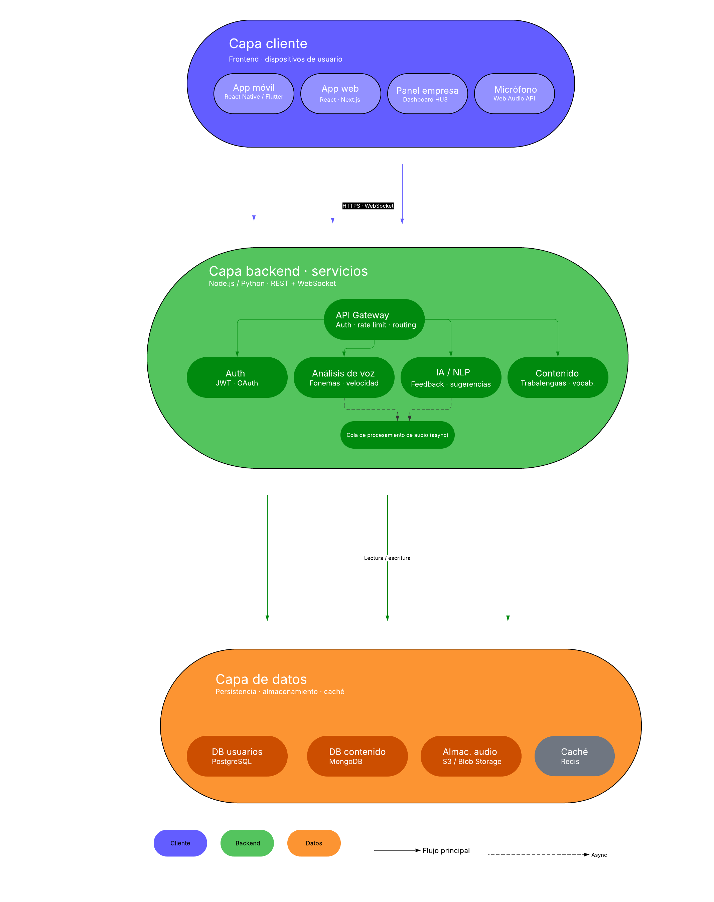

## 1. Estilo Arquitectónico 

Estilo adoptado: Cliente-Servidor 

Justificación basada en REF priorizados: El modelo seleccionado nos permitirá otorgar una retroalimentación por IA, la cuál deberá estar en un servidor aparte. Además se usará una API de Speech to Text para poder traspasar cualquier palabra pronunciada a texto. El cliente deberá solicitar el tipo de practica decidirá realizar y el servidor las mostrará. Una vez realizada la practica, el servidor enviará una evaluación mediante IA para poder determinar las capacidades de habla del usuario y sugerencias.

Trade off: Al ser un modelo Cliente-Servidor, el sistema no podrá funcionar sin una conexión a internet. También se tendrá que depender de forma estricta de un servidor para que el sistema funcione.
 

| REF ID | Descripción                              | Prioridad | Cómo lo aborda el estilo      | 
|--------|------------------------------------------|-----------|-------------------------------| 
| REF-01 | Rendimiento y eficacia                   | Alta      | Se deben tener tiempos de respuesta óptimos para que el sistema funcione bien.| 
| REF-02 | Seguridad                                | Baja      | Solo se requieren datos de inicio de sesión.| 
| REF-03 | Disponibilidad                           | Alta      | El sistema deberá estar disponible en todo momento.| 
| REF-04 | Mantenibilidad                           | Baja      | No cambiará mucho y será el mismo equipo quien mantenga el sistema| 
| REF-05 | Portabilidad                             | Alta      | El sistema debe ser portable, pues será desarrollado para dispositivos móviles.| 
| REF-06 | Usabilidad                               | Alta      | El sistema debe ser simple para que el usuario pueda usarlo sin ninguna experiencia previa.| 
| REF-07 | Escalabilidad                            | Baja      | Si bien se esperan muchos usuarios simultáneos, es posible que una vez cumplido su propósito, los usuarios dejen de usar el sistema, por lo que puede que la cantidad de usuarios se mantenga constante o baje un poco| 
| REF-08 | Interoperabilidad                        | Alta      | Se debe implementar una API de conversión de voz a texto más un modelo de IA.| 
| REF-09 | Recuperabilidad                          | Media     | Si hay fallos en el sistema, no ocurrirán perdidas graves de datos, sin embargo, lo ideal sería arreglar el sistema lo antes posible para no prolongar la interrupción.| 
| REF-10 | Testabilidad                             | Baja      | No debe ser complicado probar la aplicación en caso de error, dado a que funcionaría mediante una API desarrollada por terceros.| 

 
Explicación textual: [Describir por qué el estilo elegido es el más adecuado 

considerando los REF de alta prioridad. Ningún REF de alta prioridad puede 

quedar sin ser abordado.] 

 

## 2. Diagrama de Arquitectura 

 

 

## 3. Descomposición Modular 

 

Fundamentación: [Criterio de descomposición: por dominio, capa, funcionalidad, etc.] 

 

### Módulo 1: [Nombre] 

- Responsabilidad: [qué hace este módulo] 

- Ofrece a otros módulos: [interfaces o datos que expone] 

- Depende de: [módulos de los que consume servicios] 

 

### Módulo 2: [Nombre] 

- Responsabilidad: [qué hace este módulo] 

- Ofrece a otros módulos: [interfaces o datos que expone] 

- Depende de: [módulos de los que consume servicios] 

 

### Módulo N: [Nombre] 

- Responsabilidad: ... 

- Ofrece a otros módulos: ... 

- Depende de: ... 

 

## 4. Decisiones de Diseño 

 

### Decisión 1 

- Decisión: [qué se decide] 

- Motivación: [por qué, referenciando REF si aplica] 

- Alternativas consideradas: [qué otras opciones se evaluaron] 

- Impacto: [en qué módulos o REF afecta] 

--- 

 
